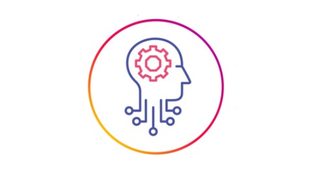
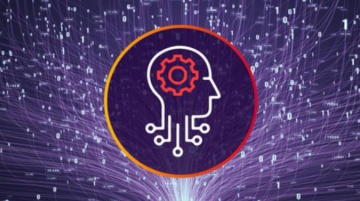

# MachineLearning
This is a collection of machine learning models and related examples.

Many of these examples are part of my online courses:


[Practical Introduction to Machine Learning](https://www.udemy.com/course/practical-machine-learning). If you want to quickly learn the essentials of machine learning, then this course is for you. You don't have to have any prior knowledge of machine learning, but some development experience is helpful.


[Practical Machine Learning by Example in Python](https://www.udemy.com/course/practical-machine-learning-python/) This is a more in-depth course for developers who want to learn how to build machine learning models using Tensorflow, NumPy, Pandas, and more.

You can run these examples locally or in the cloud, using [Google Colab](https://colab.research.google.com/notebooks/welcome.ipynb). Google Colab is a free Jupyter notebook environment that requires no setup and runs entirely in the cloud.

If you want to run Jupyter notebooks locally, follow the steps below to install Anaconda Python, Tensorflow, and Keras.

## Anaconda Python

* Install Anaconda version 3.x

Tensorflow 1.13 does not support Python 3.7, so Anaconda must be downgraded to 3.6 to support Tensorflow 1.13.

On Windows, it is necessary to run Anaconda Prompt as Administrator for the following step only:

```
conda install python=3.6
```

For the remaining steps, run Anaconda Prompt normally (Administrator is not required):

```
pip install tensorflow==1.15
pip install Keras
```
